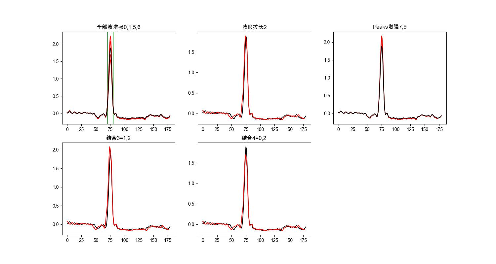
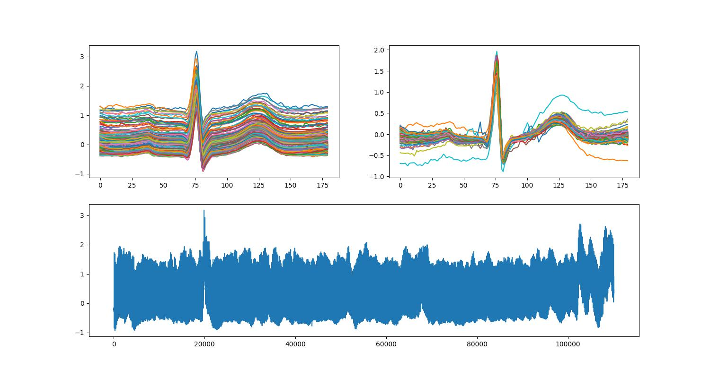

# ECG-Arrhythmia

此项目主要功能是通过机器学习来对心电数据进行诊断, 是基于`单节拍`的数据进行诊断.

目前主要诊断`室性/房性早搏`,`心动过速`,`漏搏`.

在测试集上准确率达到 `98%`以上:

```python
`N training set length 8136
N testing set length 1017
N validation set length 1017
S training set length 13740
S testing set length 1717
S validation set length 1719
V training set length 20505
V testing set length 2563
V validation set length 2564
F training set length 6616
F testing set length 827
F validation set length 827
Q training set length 8308
Q testing set length 1038
Q validation set length 1040
2018-08-31 09:13:50.276231: I tensorflow/core/platform/cpu_feature_guard.cc:141] Your CPU supports instructions that this TensorFlow binary was not compiled to use: AVX2 FMA
Start Training...Testing each 500 steps, Saving each 1000 steps

...

Confusion Matrix:

[[100   2   1   0   1]
 [  1 117   0   0   0]
 [  0   0  94   1   1]
 [  0   0   0  92   0]
 [  1   0   0   0  89]]
Sensity_N=98.04%
Sensity_S=98.32%
Sensity_V=98.95%
Sensity_F=98.92%
Sensity_Q=97.80%
======================================
Save model to path: /Users/languilin/Desktop/WorkSpacePrivate/GitHubGrayLand/ECG-Arrhythmia/TrainingModels/ModelC.ckpt

```

其他:

`神经网络结构`: 根据 `U Rajendra Acharya`教授的论文, 使用8层 CNN 网络实现.
`数据集`: 根据 `MIT`的 `physiobank` 数据库中采集和标记的数据.
`环境`: `python`,`TensorFlow`

## 准备训练数据

下载数据:

[DownloadMITData.py](./DownloadMITData.py)

由于个人使用的数据是`250采样率`, 所以要对输入数据进行处理.

我的处理步骤是: `重新采样`->`节拍提取`->`均值归一化处理`

[重新采样](./Resample.py)

数据分类, 按照论文中说的, 把数据分类成 `N,S,V,F,Q`.

(详细待写...)

## 数据扩充

由于算法基于但单节拍心电数据计算, 下载完数据, 发现各个分类的数据节拍数量差别很大, 故对一些原始数据少的进行扩充.

扩充方法主要是通过视觉原理上微调波形. 如图, 红色部分是微调后的数据:






## CNN网络

由于我自己使用的 `250的采样率`, 所以对模型进行了一些调整.


```python
def trainning_model(input_values, n_classes, reuse=False):
    with tf.variable_scope("trainning", reuse=reuse):
        # Layer 0,1
        # input 180 -> 5filters -> 180x180x5 -> 3x3size,1stride -> 178x178x5
        conv1 = tf.layers.conv1d(inputs=input_values, filters=5, kernel_size=3, strides=1, padding='valid',
                                 activation=tf.nn.relu, name='conv1')
        # input 178x178x5 -> 89x89x5
        avg_pool_1 = tf.layers.max_pooling1d(inputs=conv1, pool_size=2, strides=2, padding='valid', name='pool1')

        # Layer 2,3
        # input 89x89x5 -> 10filters -> 89x89x10 -> 4x4,1 -> 86x86x10
        conv2 = tf.layers.conv1d(inputs=avg_pool_1, filters=10, kernel_size=4, strides=1, padding='valid',
                                 activation=tf.nn.relu, name='conv2')
        # input 86x86x10 -> 43x43x10
        avg_pool_2 = tf.layers.max_pooling1d(inputs=conv2, pool_size=2, strides=2, padding='valid', name='pool2')

        # Layer 4,5
        # input 43x43x10 -> 20filters -> 43x43x20 -> 4x4,1 -> 40x40x20
        conv3 = tf.layers.conv1d(inputs=avg_pool_2, filters=20, kernel_size=4, strides=1, padding='valid',
                                 activation=tf.nn.relu, name='conv3')
        # input 40x40x20 -> 20x20x20
        avg_pool_3 = tf.layers.max_pooling1d(inputs=conv3, pool_size=2, strides=2, padding='valid', name='pool3')

        # 20x20x20 -> reshape
        pool_shape = avg_pool_3.get_shape().as_list()
        nodes = pool_shape[1] * pool_shape[2]  # * pool_shape[3]
        flat = tf.reshape(avg_pool_3, [pool_shape[0], nodes])

        # flat = tf.reshape(avg_pool_3, (-1, int(20 * 20)))

        # Full link
        dense1 = tf.layers.dense(inputs=flat, units=30, activation=tf.nn.relu, name='dense1')
        dense2 = tf.layers.dense(inputs=dense1, units=20, activation=tf.nn.relu,
                                 kernel_regularizer=tf.contrib.layers.l2_regularizer(0.2), name='dense2')

        logits = tf.layers.dense(inputs=dense2, units=n_classes, activation=None, name='logits')

    return logits
    
```

## 未完待续
